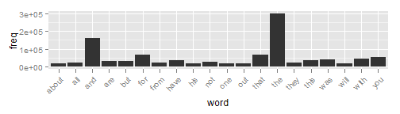

## Word Predictor!

<b>by Daniel Moore (12/14/2014)</b>

--- .class #montreal 

# Introduction
The purpose of this application is to predict the next word that the user is going to type, based on the words entered in to the text box. As described, The Text Predictor is very easy to use.

Simply type in the start of a phrase either 1, 2, or 3 words long and press "Go!". The predicted next word will appear on the right. For example, if you enter in "Georgia Institute of", the predicted word will be "technology".

Be <i>patient</i> though! It takes a while to load!

--- .class #id 

# A quick look at the data

The source of data was from a collection of English language, US based blogs, Twitter accounts, and news feeds. This data was processed (tokenized) into n-grams of size 2, 3, and 4 words, after removing punctuation, capitalization, swear words, numeric characters, and excess whitespace.

There are a lot of sparse words (that is, words that appear only once) and some very common words. Here is a graph showing the 20 most common 1-grams

 

--- .class #id 
# How the model works
First we clean up the input data by removing punctuation, extra whitespace, and special characters.

If the n-gram is directly in the vocabulary of the model, then it will suggest the next word with the highest probability of occurence. The algorithm uses a modified Kneser-Key Smoothing for the probability estimation. This allows for constructing the lower-order (backoff) model. 

If there are no good fits, then we just return the most common word, adjusting for parts of speech.

--- .class #id 

# Some Additional Thoughts

<b>Details on modified KN</b> - For example, "Los Angeles" may be common, but "Angeles" only occurs after "Los". "Angeles" may get a high 1-gram probability, so absolute discounting will give a high probability to "Angeles"" appearing after new bigram histories. So KN smoothing gives "Angeles" a low 1gram probability because it only occurs after "Los", which the 2-gram model fits well.
In this way we construct the backoff model..

--- .class #id

# Streak Analyzers

Some years, teams are streakier than other years, they tend to have long stretches of winning and losing as opposed to more consistency. One way to see how *streaky* a team is during a season is to look at the length of streaks throughout the season, both as the season progresses, as in the first chart and as a distribution, as in the second chart. These charts give a quick overview of this (removing the most common case of streaks of length 1).

