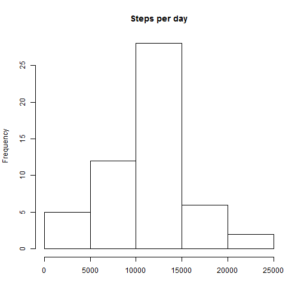
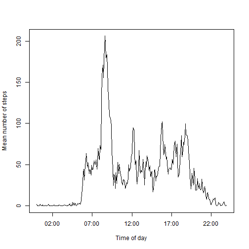
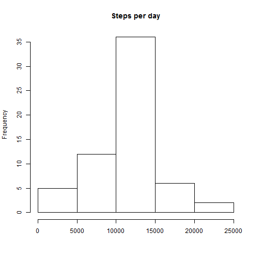
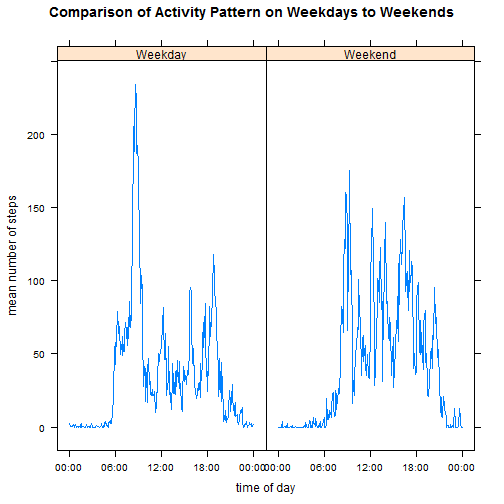

### Reproducible Research: Peer Assessment 1


## Loading and preprocessing the data

```r
library(date)
library(lubridate)
library(lattice)
library(plyr)
setwd("C:\\Users\\Daniel\\Documents\\GitHub\\RepData_PeerAssessment1")
activity<-read.csv("activity.csv", colClasses=c("integer", "character", "integer"))
activity$intervalstr<-formatC(activity$interval, width=4, format="d", flag="0")
activity$timeofday<-strptime(activity$intervalstr, "%H%M")
```


## What is mean total number of steps taken per day?

```r
summarybyday <- ddply(activity, .(date), summarize, sum = sum(steps))
hist(summarybyday$sum, xlab="", main="Steps per day")
```

 

```r
meanbyday<-mean(summarybyday$sum, na.rm=TRUE)
medianbyday<-median(summarybyday$sum, na.rm=TRUE)
sprintf("The mean total number of steps taken per day is %5.0f (rounded down)", meanbyday)
```

```
## [1] "The mean total number of steps taken per day is 10766 (rounded down)"
```

```r
sprintf("The mean total number of steps taken per day is %5.0f (rounded down)", medianbyday)
```

```
## [1] "The mean total number of steps taken per day is 10765 (rounded down)"
```


## What is the average daily activity pattern?

```r
summarybytime <- ddply(activity, .(timeofday, intervalstr), summarize, mean = mean(steps, na.rm=TRUE))
plot(summarybytime$timeofday,summarybytime$mean, type='l', xlab="Time of day", ylab="Mean number of steps")
```

 

```r
maxinterval<-summarybytime$intervalstr[which.max(summarybytime$mean)]
sprintf("The time interval with, on average, the most number of steps is %s", maxinterval)
```

```
## [1] "The time interval with, on average, the most number of steps is 0835"
```


## Imputing missing values

```r
sprintf("There are %4.0f missing values in the data set", sum(is.na(activity$steps)))
```

```
## [1] "There are 2304 missing values in the data set"
```

```r
# strategy to use - just taking the mean of the non-missing values for that five minute interval across all the days - this will fill in the average daily pattern
activitynona<-activity
for(i in 1:length(activitynona$steps)){
    if(is.na(activitynona$steps[i])){
        activitynona$steps[i]<-summarybytime$mean[summarybytime$intervalstr==activitynona$intervalstr[i]]
    }
}
summarybydaynona <- ddply(activitynona, .(date), summarize, sum = sum(steps))
hist(summarybydaynona$sum, xlab="", main="Steps per day")
```

 

```r
meanbydaynona<-mean(summarybydaynona$sum, na.rm=TRUE)
medianbydaynona<-median(summarybydaynona$sum, na.rm=TRUE)
sprintf("The mean total number of steps taken per day is %5.0f (rounded down with NAs imputed)", meanbydaynona)
```

```
## [1] "The mean total number of steps taken per day is 10766 (rounded down with NAs imputed)"
```

```r
sprintf("The median total number of steps taken per day is %5.0f (rounded down with NAs imputed)", medianbydaynona)
```

```
## [1] "The median total number of steps taken per day is 10766 (rounded down with NAs imputed)"
```
##### There is no significant difference in the mean total number of steps per day between imputing NAs to be the mean for the interval and leaving the NAs intact. This is because the NAs occur in such a way that either the entire day is missing data or the entire day has data. So, when we impute the NAs to be the mean of the interval period across the other days, then we are just making that day have a mean value that is equivalent to the mean of the other days. You will notice that there is a difference in the histograms, in that the middle bin (containing the mean) is higher when we impute the missing values.


## Are there differences in activity patterns between weekdays and weekends?

```r
activity$weekday<-weekdays(ymd(activity$date))
for(i in 1:length(activity$weekday)){
    if(activity$weekday[i] %in% c("Sunday", "Saturday")){
        activity$daycategory[i]="Weekend"
    }
    else {
        activity$daycategory[i]="Weekday"
    }
    
}
activity$daycategory <- as.factor(activity$daycategory)
summarybyweekend <- ddply(activity, .(timeofday, interval, intervalstr, daycategory), summarize, mean = mean(steps, na.rm=TRUE))

summarybyweekend$timeredone<-as.POSIXct(summarybyweekend$timeofday, format="%H:%M")

xyplot(mean~timeredone | daycategory, summarybyweekend, main="Comparison of Activity Pattern on Weekdays to Weekends", xlab="time of day", ylab="mean number of steps", type="l", scales = list("alternating"=FALSE, "format"="%H:%M"))
```

 
